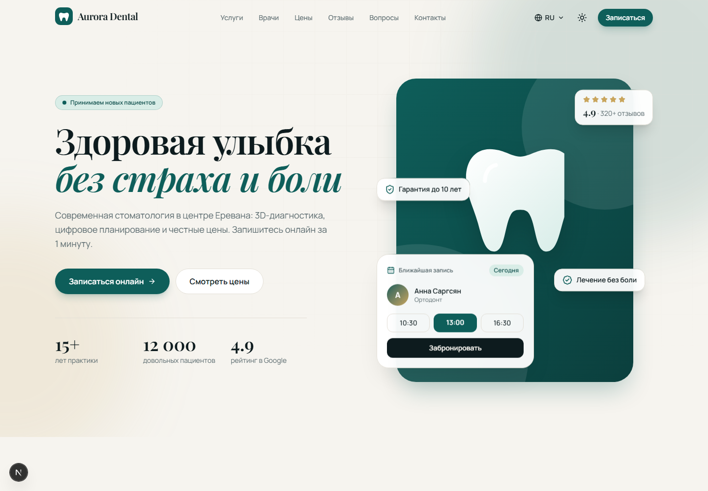
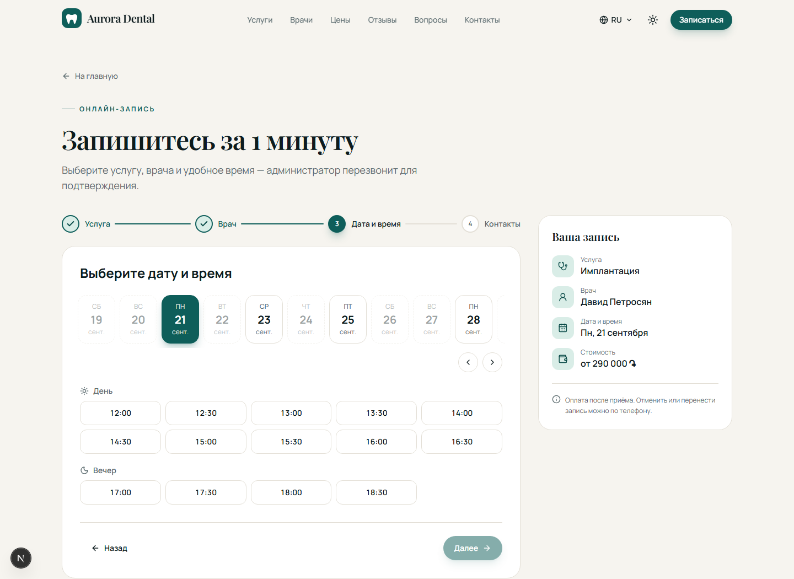
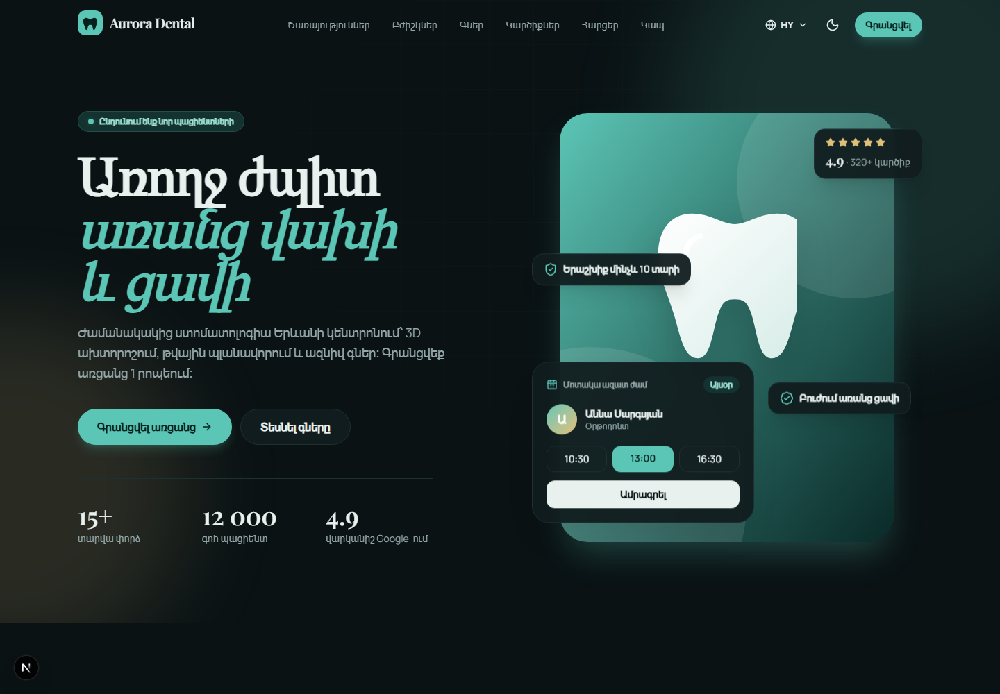
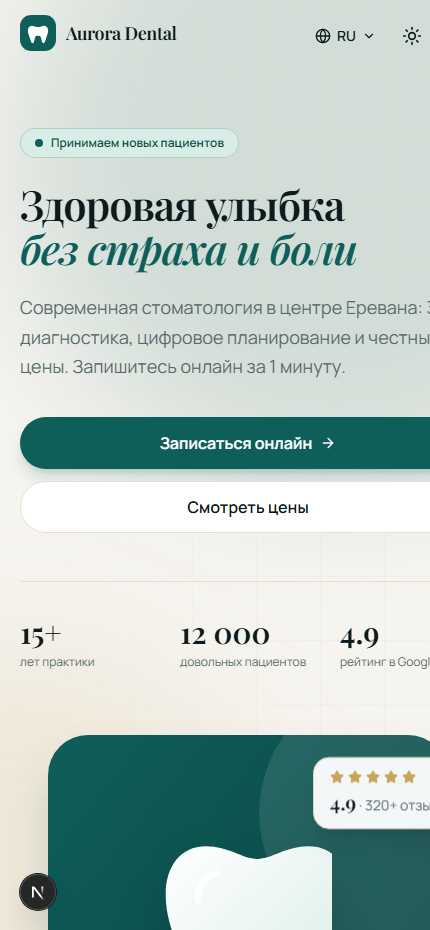

# Aurora Dental — clinic platform

[](https://github.com/amd-11/clinic-platform/actions/workflows/ci.yml)
[](https://nextjs.org)
[](https://www.typescriptlang.org)
[](src/lib)

**Live demo: [aurora-dental-yerevan.vercel.app](https://aurora-dental-yerevan.vercel.app)** ·
**Admin panel demo (read-only): [/admin](https://aurora-dental-yerevan.vercel.app/admin)** — press “View demo”

A modern, multilingual website for a dental clinic with online booking, built as a portfolio project.
The clinic, doctors and reviews are fictional — the project is a template that can be
rebranded for any clinic, beauty salon or studio.


## Screenshots

| Home page | Online booking |
| --- | --- |
| [](docs/screenshots/home.png) | [](docs/screenshots/booking.png) |

| Dark theme (Armenian) | Mobile |
| --- | --- |
| [](docs/screenshots/dark.png) |  |

## Features

- **Online booking** — service → doctor (or "any available") → date → time slot → contacts
  - Real availability from each doctor's weekly schedule and existing appointments
  - Double-booking protection: bookings lock the doctor's row inside a database transaction
  - Server-side validation (Zod), honeypot spam protection, Google Calendar link on success
- **Admin panel** (`/admin`) — dashboard with KPIs and doctor workload, appointments table with
  filters, search and status workflow (pending → confirmed → completed / cancelled), weekly schedule editor
  - Signed HTTP-only session cookies (HMAC-SHA256), permissions checked in every server action
  - **Demo access** for portfolio visitors: full interface, read-only, real patient names and phones masked
  - One-click generator of realistic sample appointments
- **Telegram notifications** — every new booking is pushed to the clinic's Telegram chat with
  inline **Confirm / Cancel** buttons that update the appointment straight from the chat
  - Webhook protected by a secret token derived from the bot token
  - Chat pairing from the admin panel: open a 10-minute window, send `/start`, done
- **3 languages** — Russian, Armenian, English (`next-intl`, locale-aware routing, `hreflang` alternates)
- **Light / dark theme** — no flash on load, remembers the visitor's choice
- **Responsive** — mobile menu, fluid typography, tested from 375 px to desktop
- **Animations** — scroll reveals with Framer Motion, CSS entrance for above-the-fold content, `prefers-reduced-motion` respected
- **Accessible** — semantic landmarks, keyboard-friendly steps, tabs, accordion and menus, ARIA attributes
- **SEO** — per-locale metadata, Open Graph, static generation for every language

### Roadmap

- [x] Stage 1 — landing page
- [x] Stage 2 — online booking
- [x] Stage 3 — admin panel
- [x] Stage 4 — Telegram notifications
- [ ] Stage 5 — AI assistant that answers patient questions 24/7
- [x] Deploy to Vercel

## Tech stack

| Area | Tools |
| --- | --- |
| Framework | Next.js 16 (App Router, Server Actions, Route Handlers), React 19 |
| Language | TypeScript |
| Database | PostgreSQL with Drizzle ORM — embedded PGlite locally, Neon in production |
| Validation | Zod |
| Styling | Tailwind CSS 4, design tokens in `globals.css` |
| i18n | next-intl 4 |
| Animation | Framer Motion |
| Icons | lucide-react |

## Quality checks

```bash
npm run lint       # ESLint
npm run typecheck  # TypeScript
npm test           # Vitest: 34 tests, including booking logic against a real database
npm run build      # production build
```

Every push runs the same four checks in GitHub Actions.
The test suite covers clinic-time conversion, form validation, patient-data masking and —
against an embedded PostgreSQL — slot availability, appointment duration blocking and the
double-booking guard (three parallel bookings, only one wins).

## Getting started

```bash
npm install
npm run dev
```

Open http://localhost:3000. No database setup is needed for development: an embedded
PostgreSQL (PGlite) is created in `~/.clinic-platform/pglite`, migrated and seeded on first request.

### Environment variables

| Variable | Where | Purpose |
| --- | --- | --- |
| `DATABASE_URL` | production | PostgreSQL connection string. Migrations run automatically before `next build`. |
| `ADMIN_PASSWORD` | production | Password for the admin panel. In development the password is `admin`. |
| `SESSION_SECRET` | recommended | Secret for signing admin sessions (falls back to `ADMIN_PASSWORD`). |
| `DEMO_ACCESS` | optional | Set to `false` to hide the read-only demo login. |
| `TELEGRAM_BOT_TOKEN` | optional | Bot token from @BotFather; enables Telegram notifications. |
| `TELEGRAM_LOCALE` | optional | Language of the bot's messages (`ru` by default). |
| `PGLITE_DATA_DIR` | optional, local | Custom folder for the embedded development database |

### Database scripts

```bash
npm run db:generate   # create a SQL migration after changing src/db/schema.ts
npm run db:migrate    # apply migrations to DATABASE_URL (runs automatically on build)
```

## Project structure

```
drizzle/             SQL migrations
messages/            Translations (ru, hy, en) — all visible text lives here
scripts/             Production migration script
src/
  app/[locale]/      Home page, /booking and /admin for each language
  app/api/slots/     Available time slots API
  app/api/telegram/  Telegram webhook (pairing + Confirm/Cancel buttons)
  components/
    admin/           Admin shell, filters, status badges, schedule editor
    booking/         Booking wizard steps, summary and success screen
    layout/          Header, footer, language switcher, theme toggle
    sections/        Home page sections: hero, services, doctors, pricing…
    ui/              Reusable building blocks: button, container, reveal
  db/                Drizzle schema, connection and reference data seed
  i18n/              Locale routing and request config
  lib/admin/         Sessions, permission guards, queries, admin server actions, demo data
  lib/booking/       Availability, validation, server action, clinic time helpers
  lib/telegram/      Bot API client, notification messages, chat settings
  lib/site-data.ts   Clinic data that does not depend on language (prices, ids)
  proxy.ts           Locale detection and redirects
```

### Rebranding for a new client

1. Change the name, phone and links in `src/lib/site-data.ts`
2. Set services, doctors and working hours in `src/db/seed.ts`
3. Edit texts in `messages/*.json`
4. Adjust the colour tokens at the top of `src/app/globals.css`
5. Replace doctor placeholders with real photos (`next/image`)

---

Developed by [Aren Mkrtchyan](https://github.com/amd-11)
